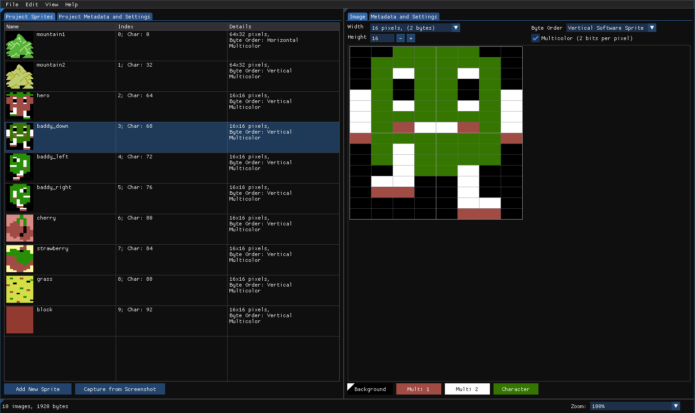
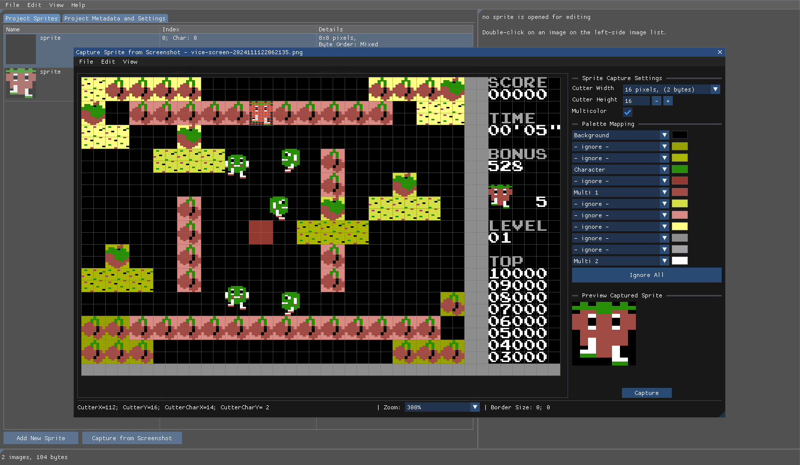
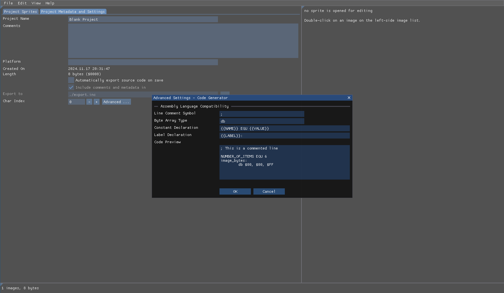
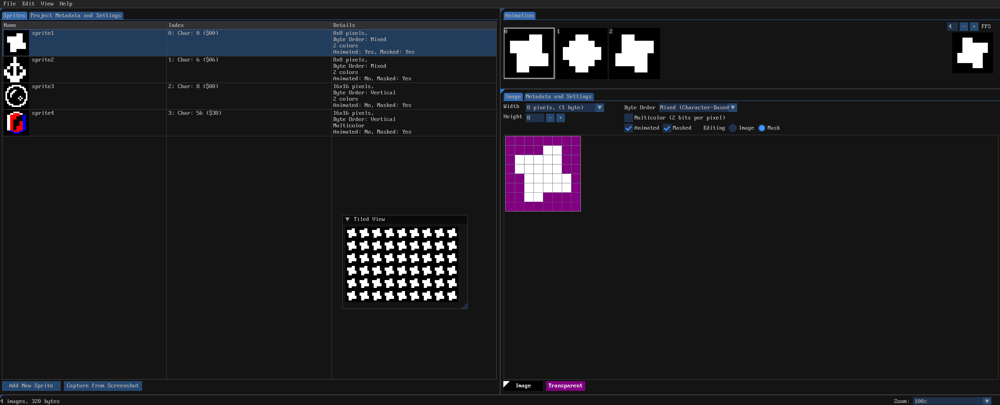

# Retro sprite workshop NG

This is a reimplementation of the excellent tool https://plus4world.powweb.com/tools/Retro_Sprite_Workshop made by TCFS, and the reason is why I started this project is that I do not use Windows and the original application is Windows only, and unfortunately, It does not work very well on Wine. But since I found it a very nice tool, and because I wanted to try ImGui in a bigger application; therefore I started this project. The application is in its beta phase, there are possibly numerous bugs or miss functionality if compared with the original, but it is functional enough for me, and maybe for others as well. The main view of the application:



The application also has a tool embedded that can be used to rip-off graphics from existing games or from any screenshot and create a graphics from them.



It is also possible to compile the code for Windows as well with MingW64.

The application generates source code for any assembler (the assembler pseudocode is configurable).




It contains a simple animation editor, masked sprites and also a tiled view.



## How to build & run

### Linux

```
make
```

To run the application

```
./rswng
```

### For Windows

Cross compile for Windows version on Linux

```
CXX=x86_64-w64-mingw32-g++ make build-win32
make win32-distro
```

Then you can use `rswng.zip` to transfer everything needed for application to run on Windows.

---

Thanks to:

* https://plus4world.powweb.com/members/TCFS
* https://github.com/ocornut/imgui
* https://www.libsdl.org

